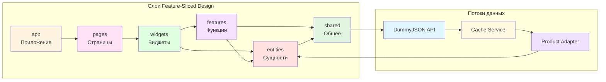

# Shopper

Современный интернет-магазин электроники, построенный на React и TypeScript с использованием архитектуры Feature-Sliced Design.

## 📋 Описание

**Shopper** — это полнофункциональное веб-приложение для продажи электроники с удобным интерфейсом, корзиной покупок, поиском товаров и фильтрацией. Проект демонстрирует современные подходы к разработке React-приложений с акцентом на архитектуру, типобезопасность и пользовательский опыт.

## 🚀 Технологический стек

### Основные технологии

- **React 18.2.0** — библиотека для построения пользовательских интерфейсов
- **TypeScript 5.2.2** — типизированный JavaScript
- **Vite 5.0.8** — быстрый сборщик и dev-сервер
- **React Router DOM 7.9.6** — маршрутизация (HashRouter)

### UI и стилизация

- **Tailwind CSS 3.4.18** — utility-first CSS фреймворк
- **Radix UI** — доступные UI компоненты (Dialog, Slot)
- **Motion** — библиотека для анимаций
- **Lucide React** — набор иконок
- **Class Variance Authority** + **clsx** + **tailwind-merge** — управление классами

### Дополнительные библиотеки

- **@faker-js/faker** — генерация тестовых данных

## 🏗️ Архитектура

Проект следует методологии **Feature-Sliced Design (FSD)**:

### Структура проекта

```mermaid
graph TD
    A[src/] --> B[app/]
    A --> C[pages/]
    A --> D[widgets/]
    A --> E[features/]
    A --> F[entities/]
    A --> G[shared/]

    B --> B1[App.tsx]
    B --> B2[providers/]
    B2 --> B3[CartProvider.tsx]
    B2 --> B4[ToastProvider.tsx]

    C --> C1[home/]
    C --> C2[products/]
    C --> C3[blog/]
    C --> C4[about/]
    C --> C5[features/]

    D --> D1[header/]
    D --> D2[footer/]
    D --> D3[hero-section/]
    D --> D4[product-list/]
    D --> D5[cart-modal/]

    E --> E1[add-to-cart/]
    E --> E2[search-products/]
    E --> E3[toggle-theme/]

    F --> F1[product/]
    F --> F2[cart/]
    F1 --> F1A[api/]
    F1 --> F1B[model/]
    F1 --> F1C[ui/]
    F2 --> F2A[model/]

    G --> G1[api/]
    G --> G2[ui/]
    G --> G3[lib/]
    G1 --> G1A[clients/]
    G1 --> G1B[adapters/]
    G1 --> G1C[cache/]
    G1 --> G1D[utils/]
    G2 --> G2A[Button]
    G2 --> G2B[Card]
    G2 --> G2C[Dialog]
    G2 --> G2D[Badge]
    G2 --> G2E[Skeleton]
    G3 --> G3A[hooks/]
    G3 --> G3B[utils.ts]

    style A fill:#e1f5ff
    style B fill:#fff4e1
    style C fill:#ffe1f5
    style D fill:#e1ffe1
    style E fill:#f5e1ff
    style F fill:#ffe1e1
    style G fill:#e1f5e1
```



### Текстовая структура

```
src/
├── app/          # Инициализация приложения, провайдеры
│   ├── App.tsx
│   └── providers/
│       ├── CartProvider.tsx
│       └── ToastProvider.tsx
│
├── pages/        # Страницы приложения
│   ├── home/
│   ├── products/
│   ├── blog/
│   ├── about/
│   └── features/
│
├── widgets/      # Композитные UI-блоки
│   ├── header/
│   ├── footer/
│   ├── hero-section/
│   ├── product-list/
│   └── cart-modal/
│
├── features/     # Бизнес-функции
│   ├── add-to-cart/
│   ├── search-products/
│   └── toggle-theme/
│
├── entities/     # Бизнес-сущности
│   ├── product/
│   └── cart/
│
└── shared/       # Переиспользуемые модули
    ├── api/      # API клиенты, адаптеры, кэш
    ├── ui/       # UI компоненты
    └── lib/      # Утилиты и хуки
```

### Взаимодействие слоев FSD



### Слои архитектуры

- **app/** — точка входа приложения, провайдеры контекста
- **pages/** — страницы приложения (Home, Products, Blog, About, Features)
- **widgets/** — сложные композитные компоненты (Header, Footer, ProductList, CartModal)
- **features/** — бизнес-функции (добавление в корзину, поиск, переключение темы)
- **entities/** — бизнес-сущности с их логикой (Product, Cart)
- **shared/** — переиспользуемый код (UI компоненты, API клиенты, утилиты)

## ✨ Основной функционал

### 🛍️ Каталог товаров

- Загрузка товаров из DummyJSON API
- Фильтрация по бренду и цене
- Сортировка (по умолчанию, по возрастанию/убыванию цены)
- Поиск товаров с автодополнением
- Карточки товаров с детальной информацией
- Модальные окна для просмотра деталей товара

### 🛒 Корзина покупок

- Добавление/удаление товаров
- Изменение количества товаров
- Подсчет общей суммы заказа
- Модальное окно корзины
- Плавающая кнопка корзины с индикатором количества

### 🎨 UI/UX

- Поддержка темной и светлой темы
- Плавные анимации переходов
- Полностью адаптивный дизайн
- Toast-уведомления для действий пользователя
- Skeleton-экраны при загрузке данных
- Модальные окна для детального просмотра

### 🧭 Навигация

- Роутинг между страницами
- Мобильное меню
- Поиск товаров в шапке сайта

## 🌐 API и данные

**Источник данных:** [DummyJSON API](https://dummyjson.com)

### Основные функции API:

- `fetchProducts()` — получение товаров с пагинацией и фильтрацией по категориям
- `searchProducts()` — поиск товаров по запросу
- `fetchProductById()` — получение конкретного товара по ID
- `fetchCategories()` — получение списка категорий

### Особенности работы с API:

- **Кэширование** — результаты запросов кэшируются на 2-30 минут (в зависимости от типа запроса)
- **Retry-логика** — автоматические повторы при ошибках
- **Адаптеры** — преобразование данных API в внутренние типы приложения
- **Фильтрация** — автоматическая фильтрация только электроники

## 📦 Управление состоянием

- **Context API** для глобального состояния:
  - `CartProvider` — управление корзиной покупок
  - `ToastProvider` — управление уведомлениями
- **Локальное состояние** через `useState` и `useEffect`
- **Кастомные хуки** для бизнес-логики:
  - `useCart` — работа с корзиной
  - `useProducts` — работа с товарами
  - `useSearch` — поиск товаров
  - `useTheme` — переключение темы

## 🎨 Стилизация

- **Tailwind CSS** с кастомными CSS-переменными
- Поддержка темной/светлой темы через CSS-переменные
- Адаптивные стили для мобильных устройств
- Переиспользуемые UI компоненты:
  - `Button` — кнопки с вариантами стилей
  - `Card` — карточки товаров
  - `Dialog` — модальные окна
  - `Badge` — бейджи
  - `Skeleton` — скелетоны загрузки

## 🔧 Разработка

### Установка зависимостей

```bash
npm install
```

### Запуск dev-сервера

```bash
npm run dev
```

### Сборка проекта

```bash
npm run build
```

### Просмотр production сборки

```bash
npm run preview
```

### Линтинг

```bash
npm run lint
```

### Деплой

```bash
npm run deploy
```

## 📝 Типизация

Проект использует строгий режим TypeScript:

- Все сущности типизированы (`Product`, `CartItem`, `CartState`)
- Типизированы все API-ответы
- Используются алиасы путей для удобного импорта:
  - `@/app/*`
  - `@/pages/*`
  - `@/widgets/*`
  - `@/features/*`
  - `@/entities/*`
  - `@/shared/*`

## 🎯 Особенности реализации

### Производительность

- Кэширование API-запросов для уменьшения нагрузки
- Оптимизация рендеринга компонентов
- Lazy loading где применимо

### Пользовательский опыт

- Плавные анимации для всех интерактивных элементов
- Skeleton-экраны для улучшения восприятия загрузки
- Toast-уведомления для обратной связи с пользователем
- Модальные окна для детального просмотра без перехода на другую страницу

### Архитектура

- Четкое разделение ответственности между слоями
- Переиспользуемые компоненты и утилиты
- Централизованное управление API-запросами
- Полная типобезопасность

## 📄 Лицензия

Проект создан в образовательных целях.

## 👤 Автор

Проект разработан с использованием современных практик разработки React-приложений.

---

**Версия:** 2.0.0
